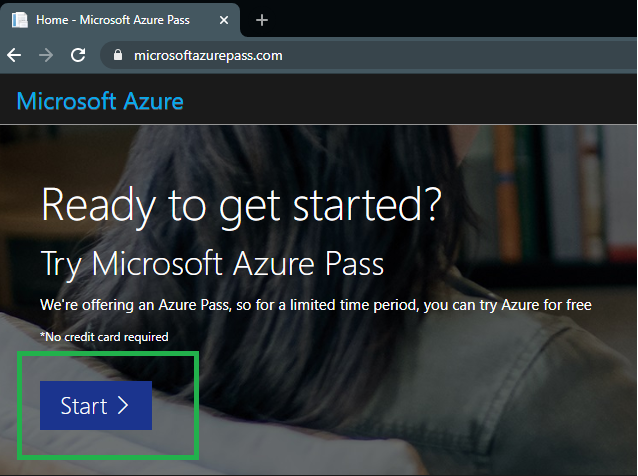
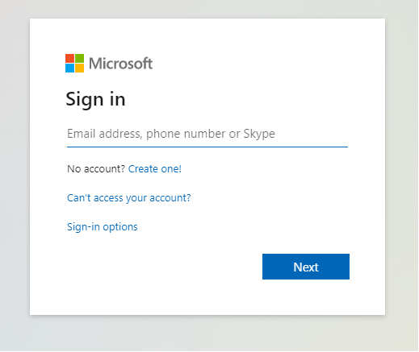
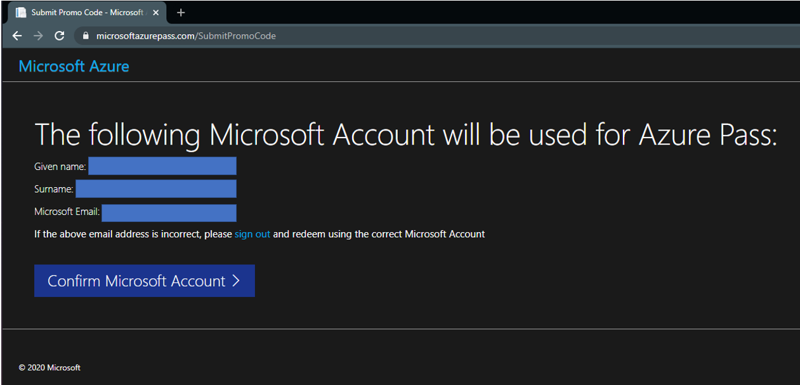
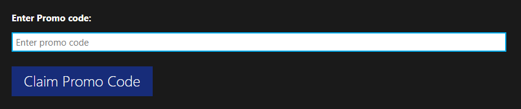
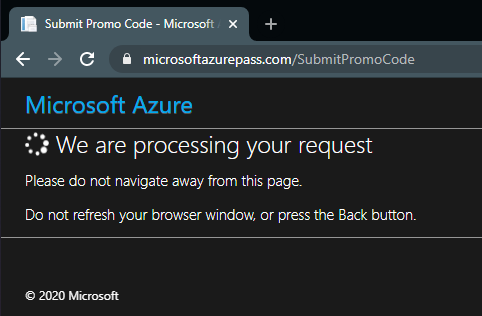
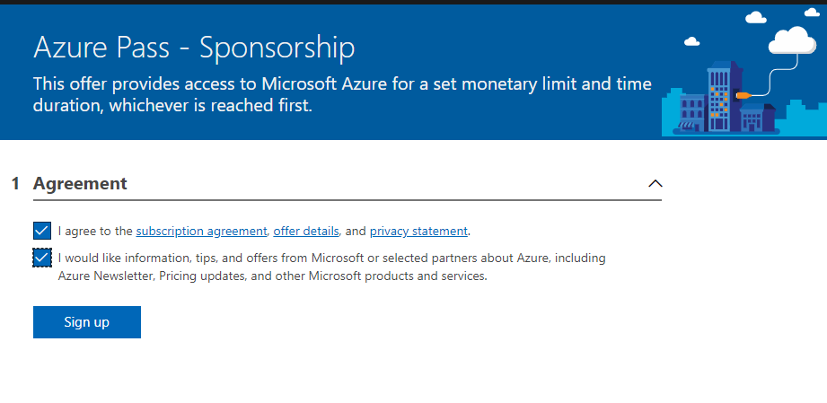
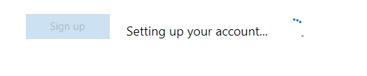
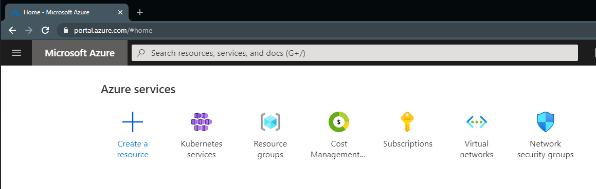
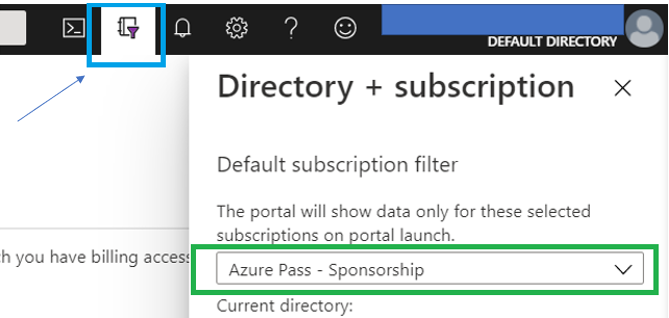

# Setting up your Azure Account using Subscription pass

#### Steps

* Open your browser in **`private / incognito`** mode to avoid auto signing into your work account

* Create yourself a new `outlook / hotmail` account. 

    * This can just be a temporary account for the purpose of this workshop but make sure to not forget the credentials for it. 

    * You will be using this account to create your Azure subscription that will be used for workshop labs. 

* Once you've completed the above step, visit the below website to redeem your subscription pass.

    > https://www.microsoftazurepass.com/
   
* Click `start` button to get started 

    

* Enter your **`newly created or temporary outlook / hotmail`** email address. 

* Click `Next` to proceed and enter your password to `Sign in`

    

* Verify your information (Make sure it's the correct `hotmail / outlook` email address). When ready, click `Confirm Microsoft Account` to proceed. 

    

* Enter the `Promo Code (subscription pass)` provided to you and click `Claim Promo Code`

    

* You should see a processing message such as below and this may take a few minutes

    

* You should then see the below page. Tick the required checkboxes and Click `Sign up` to setup your azure account.

    

* You should see something like below. 

    

    > Note: Your Azure account creation may take upto 15 minutes and you may get a message such as `"it's taking longer than usual"` and this is common for accounts created using passes.
    
* Once your account is created, you will be redirected to your `Azure Portal` such as below

    

* You should see your `Azure Subscription` appearing as below as a default subscription.

    * If you see something like below, you are all set with Azure account creation.

    
  
    _If you have attended workshops with us before and are using an email account you previously created, make sure the new subscription is selected and set as default._

  

> **Important Note:** 
 Your subscription pass has a limited amount of credit and an expiration date. To get the most out of it, make sure to turn off / suspend any resources before logging out and use it before the validity expires.

