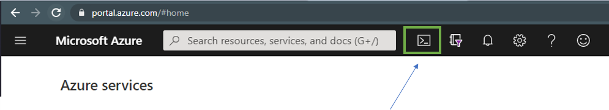
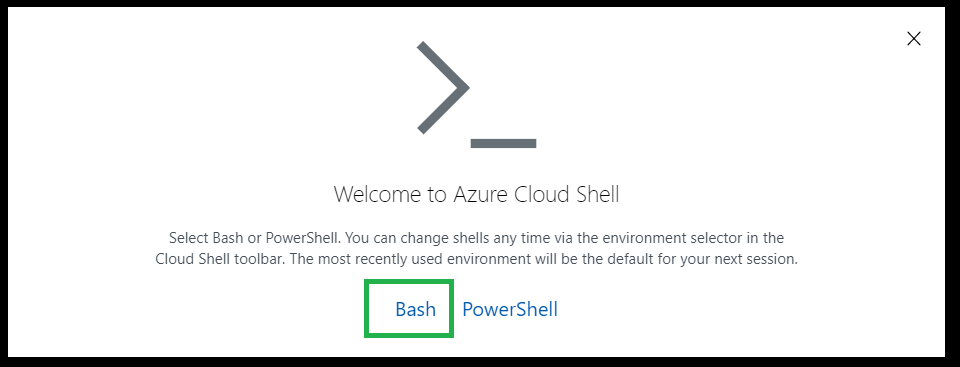
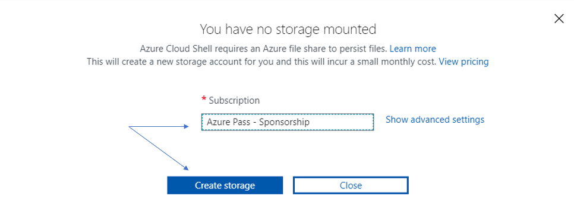
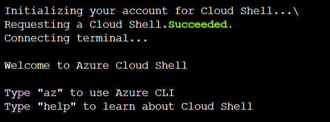
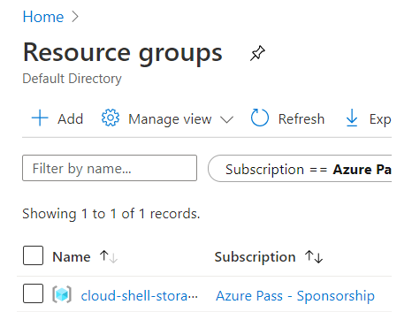
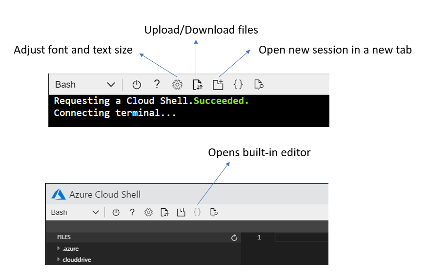

# Setting up Azure cloud shell

#### Steps

* From Azure Portal (https://portal.azure.com)

    * Click on the `Cloud Shell icon` such as below. Make sure you are logged into the correct account that's been setup for workshop.   

    
    
* You will be prompted to choose the type of shell. For this workshop, we will be using `Bash`. 

    

* Make sure the correct subscription is selected, and click on `Create Storage`. This may take a few minutes.

    

* Once your cloud shell is ready, you should see a welcome message such as below followed by a prompt.

    

* Behind the scenes, Azure would already have created a resource group such as below for your shell's storage account as well.

    

* If you're new to Azure Cloud Shell, be sure to take a look at below link for helpful tips. (such as copy and paste)

    > **[Using the Cloud Shell Window](https://docs.microsoft.com/en-us/azure/cloud-shell/using-the-shell-window)**

* Here is a quick overview of some of its features. 

    

    * The built-in [Monaco Editor](https://github.com/Microsoft/monaco-editor) is the same one that powers VS Code. 

* You can always open a new instance of your `Azure Cloud Shell` by going to https://shell.azure.com (just make sure you are logged into the correct account)