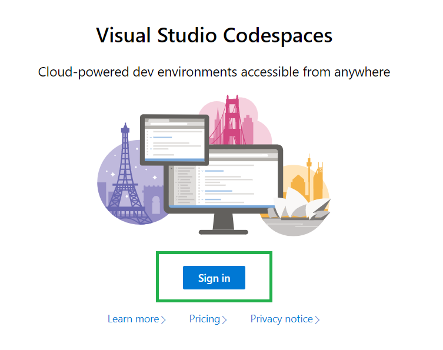
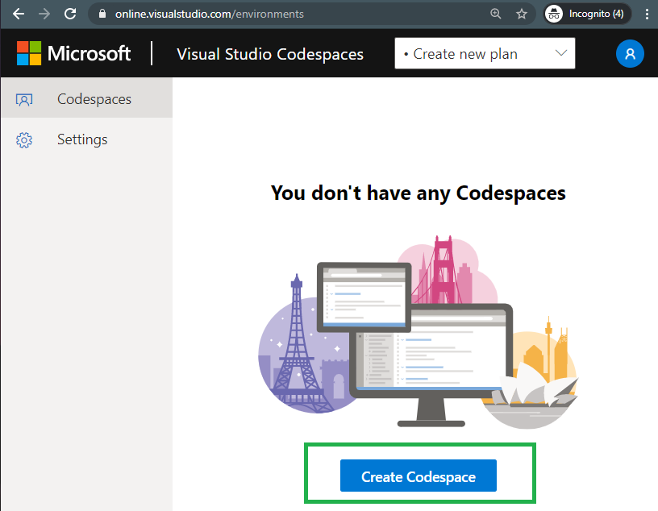
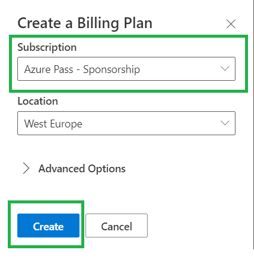
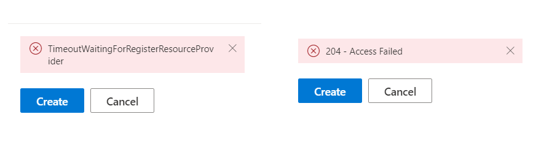
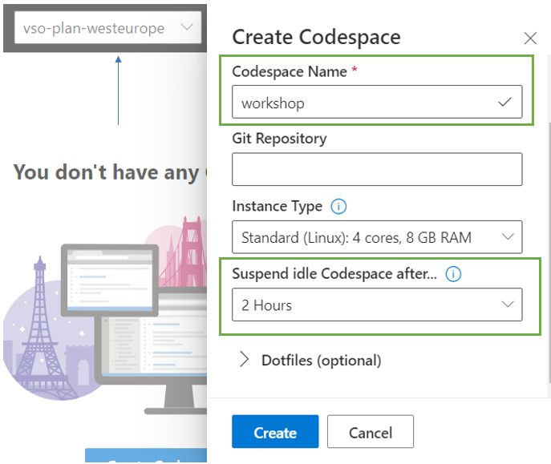
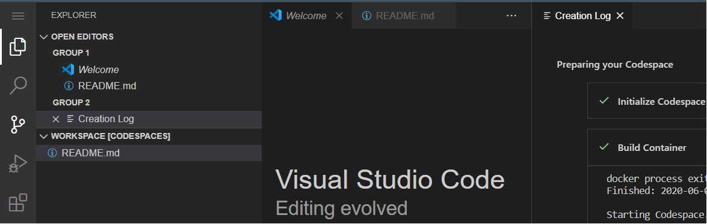
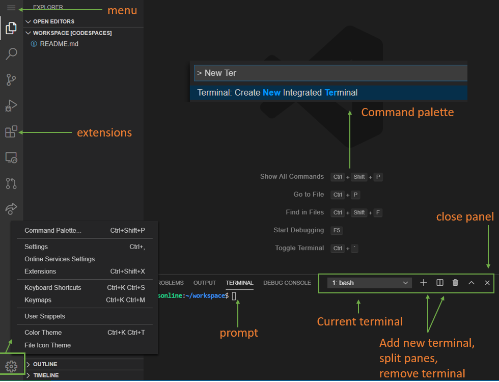
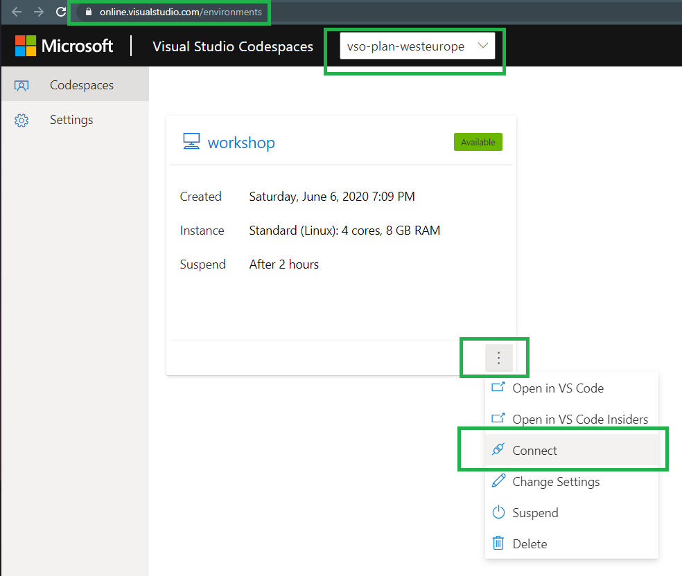
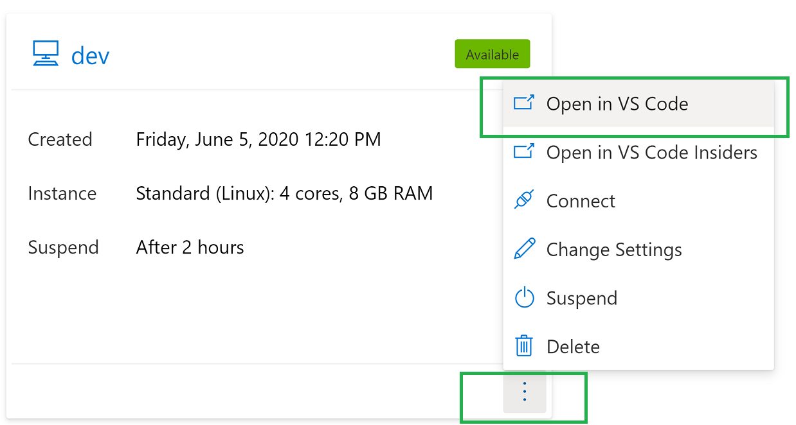

# Setting up your Visual Studio Codespace environment (VS Code Online)
 
#### Steps

* Navigate to https://online.visualstudio.com/login and click `Sign in` 

    

* You should automatically be redirected to `Codespaces` landing page if you are already signed into the Azure Portal on a different tab.

    * But, if prompted to sign in, make sure to login with the same `outlook / hotmail account` that was used to create the Azure subscription. 

* Click on `Create Codespace` to get started

    

* Make sure the correct subscription is selected, and then click `Create` to create your billing plan. This may take a few minutes.

    * This will also create a `Resource Group` for you in selected `Location` (_by default, West Europe_)

    

    * _If you get any error messages such as below, just hit `cancel` and try the above step again after a couple of minutes._

        
    
* Once your billing plan is ready, create a new codespace. 

    * Give it a name of your choice and set the suspend idle timeout to `2 hours`. Codespace will auto suspend after 2 hours to help with cost savings.

      

* It may take a couple of minutes to `Initialize the codespace`. 

    * Once it's initialized, you should see your `codespace environment` (vs code on the cloud) such as below and you're all set to go. 

      

* If you are new to `vs code`, take a few minutes to familiarzie yourself with the IDE. Here is a quick overview.

        

* To connect back to your codespaces environment, just go to https://online.visualstudio.com/environments and connect to your environment as shown below.

     

* If you're interested to know / learn more about vs code, see: https://code.visualstudio.com/docs/getstarted/tips-and-tricks 

---

## Bonus: For Users already familiar with VS Code and its Remote Explorer capabilities

> If you're new to `vs code`, feel free to skip this step. You can always revisit it later.

1. If you are already familiar with VS Code's client/server model and its features such as `Remote Explorer` extension, then you can use the same to oepn `codespaces` from your `vs code` on your local / dev machine.

2. This is done by `opening` codespace in `vs code` as below

    

    > The above will prompt you to install `codespaces` extension on your vs code on local machine, so you should have permissions for this.

3. If it's all done correctly, you should notice `codespaces` appearing as a `target` in `Remote Explorer`. Now you can connect to it from your local machine's VS Code.

4. This will provide a powerful setup and will allow you to directly access the `localhost`  on your browser when doing things like `port-forwarding`

5. However, if you're new to `vs code`, it's best to skip this step for now.

---