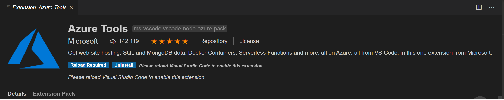

# Setting up your lab environment

### 01 Clone the repo into your vsonline workspace (or your environment of choice)

```bash
    git clone https://github.com/surenmcode/az200.git
```

**cd az200**

> **Important** If you are on vs online, it is highly recommended to keep your lab work backed up in a version control hub such as github. Vs online is still in public preview and if your environment gets accidentally corrupted, you will lose your lab files. As always, please **do not** check-in any sensitive information into version control.

### 02 Install linux command line tools. 

> If you are new to linux command line, just install the below ones that would be helpful later during the labs.

```bash
# Cd into 00_setup folder (prefix parent dir as needed)
    cd labs/00_setup
```

```bash
# Install command line tools such httpie, jq, tmux. We will cover them later during demos.
    chmod +x 01_lab_tools.sh
    ./01_lab_tools.sh
```

## Azure Cli setup

1. vsonline comes with azure cli installed. Make sure you can log into your account by typing the below and following the instructions on your terminal.

```bash
    az login
```

2. Check which subscription you have connected to:

    ```bash
    az account show
    ```

3. If you prefer, you can switch to a different subscription:

    ```bash
    az account set --subscription <subscription-name>
    ```
4. Run a command such as below to display all the resource groups in your subscription. (vs online one should appear)

    ```bash
    az group list
    ```

## Install Azure tools extension for vs code (recommended)

Click on the extensions button from the left panel (shortcut: ctrl + shift + x) and search for `Azure Tools` extension. This is a meta extension that includes several extensions related to Azure that could be helpful during the labs.



Reload vs code online when prompted (or when the `Reload Required` button appears)

#### Install any dev tools and extensions you need on vs online

> Feel free to configure your vs online environment as you prefer. It already comes with dotnet and nodejs installed. 

#### Some command line tips

* Ctrl + C - exit (sometimes ctrl + d if you are in a python interpreter for example)
* Ctrl + L - clear screen
* Ctrl + A - go to begining of the line
* Ctrl + E - go to end of the line (may be overrided with vs shortcuts)

>Note: `tmux` stands for terminal multiplexer and has many useful features such as `split-panes`,  `sessions`, `synchronized typing`,  etc. To use it just type `tmux` and then `ctrl + b` followed by `"` or `%` to split the panes as needed. To exit tmux, just type `exit`. See [docs](https://tmuxcheatsheet.com/) for more options such as sessions. 

#### VS Code tips

* Ctrl + shift + p - Command palette. From there,
    * To toggle / maximize vs terminal, type `Maximized Panel` 
